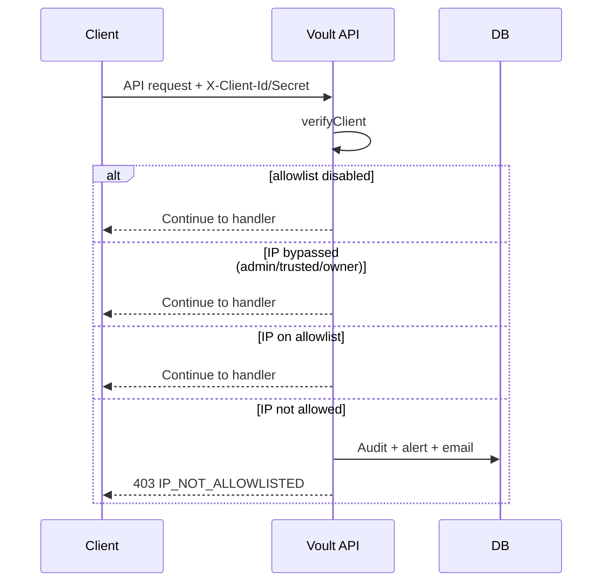

# IP Allowlisting Guide

Per-app IP allowlisting restricts which IP addresses can call your Voult application's API. This fulfills the Phase 4 checklist in [PRODUCTION_READINESS_CERTIFICATION.md](./PRODUCTION_READINESS_CERTIFICATION.md) and the "IP allowlisting system" deliverable in [SECURITY_HARDENING_GUIDE.md](./SECURITY_HARDENING_GUIDE.md).

---

## Overview

When enabled for an app, only requests from allowlisted IPv4 addresses or CIDR ranges can reach endpoints protected by `verifyClient` (registration, login, MFA, sessions, etc.).

| Component | Responsibility |
|-----------|----------------|
| `models/ipAllowlistEntry.js` | Stored IPs/CIDRs per app |
| `models/ipAllowlistAlert.js` | New/blocked IP notifications |
| `services/ipAllowlistService.js` | Matching, bypass rules, alerts |
| `middleware/enforceIpAllowlist.js` | Blocks non-allowlisted API traffic |
| `routes/api/ipAllowlist.js` | Developer management API |

---

## How enforcement works



Enforcement runs automatically after `verifyClient` succeeds. Management endpoints (`/api/ip-allowlist/*`) use developer session auth and are **not** blocked by the allowlist (so you cannot lock yourself out).

---

## Admin bypass rules

Requests bypass the allowlist when any of these apply:

| Bypass | Configuration |
|--------|---------------|
| Platform trusted IPs | `TRUSTED_IPS` env (comma-separated) |
| Platform admin IPs | `PLATFORM_ADMIN_IPS` env |
| App owner session | Developer logged into portal + owns the app |
| Admin bypass entries | Allowlist entries with `isAdminBypass: true` |
| Emergency bypass secret | `X-Ip-Allowlist-Bypass` header matches `IP_ALLOWLIST_BYPASS_SECRET` |

Use admin bypass entries sparingly for ops/monitoring IPs only.

---

## Management API

Requires developer session (Passport) + `X-Client-Id` for the app you own. No client secret needed.

| Method | Path | Purpose |
|--------|------|---------|
| `GET` | `/api/ip-allowlist/settings` | Get enable/notify settings |
| `PATCH` | `/api/ip-allowlist/settings` | Enable allowlist or notifications |
| `GET` | `/api/ip-allowlist/entries` | List allowlisted IPs/CIDRs |
| `POST` | `/api/ip-allowlist/entries` | Add IP or CIDR |
| `DELETE` | `/api/ip-allowlist/entries/:id` | Remove entry |
| `GET` | `/api/ip-allowlist/alerts` | List new/blocked IP alerts |
| `POST` | `/api/ip-allowlist/alerts/:id/acknowledge` | Acknowledge alert |
| `GET` | `/api/ip-allowlist/check-ip` | Test if current IP would pass |

### Enable allowlisting

```bash
curl -X PATCH https://api.voult.dev/api/ip-allowlist/settings \
  -H "Cookie: connect.sid=..." \
  -H "X-Client-Id: app_abc123" \
  -H "Content-Type: application/json" \
  -d '{ "enabled": true, "notifyNewIps": true }'
```

### Add an IP or CIDR

```json
POST /api/ip-allowlist/entries
{
  "value": "203.0.113.0/24",
  "label": "Production servers",
  "isAdminBypass": false
}
```

Supported formats: single IPv4 (`203.0.113.10`) or CIDR (`203.0.113.0/24`).

---

## Notification system

When `ipAllowlistNotifyNewIps` is enabled and a blocked request occurs:

1. An `IpAllowlistAlert` record is created or updated
2. Audit log records `IP_ALLOWLIST_BLOCKED`
3. App owner receives an email (first occurrence per IP)
4. Alerts appear in `GET /api/ip-allowlist/alerts`

Acknowledge alerts after review so your dashboard stays actionable.

---

## Environment variables

```bash
# Existing — also bypasses allowlist and rate limits
TRUSTED_IPS=203.0.113.1,203.0.113.2

# Platform operations team IPs (bypass allowlist)
PLATFORM_ADMIN_IPS=198.51.100.10

# Emergency break-glass header value
IP_ALLOWLIST_BYPASS_SECRET=your_long_random_secret
```

Send `X-Ip-Allowlist-Bypass: your_long_random_secret` only from trusted automation during incidents.

---

## Integration checklist

- [ ] Add your server egress IPs before enabling the allowlist
- [ ] Use CIDR ranges for cloud providers with dynamic egress pools
- [ ] Enable `notifyNewIps` during rollout to catch missing IPs
- [ ] Add admin bypass entry for your CI/CD runner if needed
- [ ] Test with `GET /api/ip-allowlist/check-ip` from each environment
- [ ] Monitor `IP_ALLOWLIST_BLOCKED` events in audit logs

---

## Audit events

| Action | When |
|--------|------|
| `IP_ALLOWLIST_BLOCKED` | Request rejected |
| `IP_ALLOWLIST_NEW_IP` | New IP observed (notify flow) |
| `IP_ALLOWLIST_ENTRY_ADDED` | Developer adds entry |
| `IP_ALLOWLIST_ENTRY_REMOVED` | Developer removes entry |
| `IP_ALLOWLIST_SETTINGS_UPDATED` | Enable/disable or notify toggle |

---

## Common pitfalls

1. **Enabling before adding your own server IP** — you will block your integration immediately.
2. **Forgetting staging IPs** — add all environments before enabling in production.
3. **Using IPv6-only clients** — current matcher supports IPv4 and IPv4-mapped addresses.
4. **Relying on bypass secret in client code** — keep `IP_ALLOWLIST_BYPASS_SECRET` server-side only.

---

## Related documentation

- [PRODUCTION_READINESS_CERTIFICATION.md](./PRODUCTION_READINESS_CERTIFICATION.md) — Phase 4 IP allowlisting checklist
- [SECURITY_HARDENING_GUIDE.md](./SECURITY_HARDENING_GUIDE.md) — Advanced features roadmap
- [WEBAUTHN_GUIDE.md](./WEBAUTHN_GUIDE.md) — Passwordless authentication
- [MFA_TOTP_GUIDE.md](./MFA_TOTP_GUIDE.md) — MFA integration
