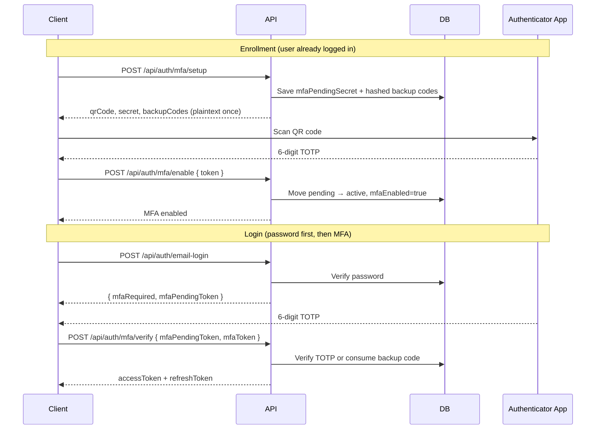

# MFA / TOTP Guide

This document explains how multi-factor authentication (MFA) works in Voult, and how to port the same design to another codebase.

Voult uses **TOTP** (Time-based One-Time Password) compatible with Google Authenticator, Authy, 1Password, and similar apps. It also supports **one-time backup codes** for account recovery.

---

## Overview

MFA is split into two flows:

1. **Enrollment** — an authenticated user enables MFA on their account.
2. **Login** — after a successful password check, the user must provide a TOTP code or backup code before receiving access tokens.

The API is **stateless**. Instead of server sessions, Voult uses:

- **Pending setup fields** on the user record during enrollment (`mfaPendingSecret`, etc.)
- A short-lived **`mfaPendingToken` JWT** during login (5-minute expiry)

---

## Architecture



---

## Key files in this codebase

| File | Responsibility |
|------|----------------|
| `services/mfaService.js` | TOTP generation/verification, backup codes, lockout helpers |
| `controllers/api/mfa.js` | Enrollment, login verification, disable, backup code regeneration |
| `routes/api/mfa.js` | Route definitions under `/api/auth/mfa` |
| `validators/api/mfa.js` | Request validation (Joi) |
| `models/endUser.js` | MFA fields on the user schema |
| `utils/jwt.js` | `signMfaPendingToken` / `verifyMfaPendingToken` |
| `controllers/api/auth.js` | Password login returns `mfaPendingToken` when MFA is enabled |
| `services/authLoginService.js` | Shared logic to issue tokens after successful auth |
| `tests/services/mfaService.test.js` | Unit tests |

### Dependencies

```bash
npm install speakeasy qrcode
```

- **speakeasy** — RFC 6238 TOTP secret generation and verification
- **qrcode** — generates a scannable QR image from the `otpauth://` URL

---

## Database fields

Add these fields to your user model (sensitive fields use `select: false` so they are not returned by default):

```javascript
mfaEnabled: { type: Boolean, default: false },
mfaSecret: { type: String, select: false },
mfaBackupCodes: { type: [String], select: false, default: [] }, // SHA-256 hashes
mfaEnabledAt: Date,

// Pending enrollment (expires after 10 minutes)
mfaPendingSecret: { type: String, select: false },
mfaPendingBackupCodes: { type: [String], select: false, default: [] },
mfaPendingExpires: Date,

// Brute-force protection
failedMfaAttempts: { type: Number, default: 0 },
mfaLockUntil: { type: Date, default: null }
```

**Never store:**

- Plaintext TOTP secrets in API responses after enrollment completes
- Plaintext backup codes in the database (only SHA-256 hashes)

---

## Enrollment flow

### Step 1 — Start setup

**`POST /api/auth/mfa/setup`**

Requires: authenticated end-user (`Authorization: Bearer <accessToken>`), app client headers (`X-Client-Id`, `X-Client-Secret`).

```json
// Response
{
  "message": "Scan the QR code with your authenticator app, then confirm with a 6-digit code",
  "qrCode": "data:image/png;base64,...",
  "secret": "JBSWY3DPEHPK3PXP",
  "backupCodes": ["A1B2C3D4", "E5F6A7B8", "..."]
}
```

What happens server-side:

1. Generate a TOTP secret via `speakeasy.generateSecret()`
2. Render QR code from `secret.otpauth_url`
3. Generate 10 backup codes; hash them before saving
4. Store secret + hashed codes in **pending** fields with a 10-minute expiry
5. Return QR code, manual-entry secret, and **plaintext backup codes once**

The client should prompt the user to save backup codes immediately. They cannot be retrieved later except by regenerating new ones.

### Step 2 — Confirm and enable

**`POST /api/auth/mfa/enable`**

```json
// Request
{ "token": "123456" }

// Response
{ "message": "MFA enabled successfully", "mfaEnabled": true }
```

What happens server-side:

1. Verify the 6-digit TOTP against `mfaPendingSecret`
2. Move pending secret/codes to active fields
3. Set `mfaEnabled = true`, clear pending fields
4. Increment `tokenVersion` (invalidates existing sessions)

If setup expires (10 minutes), the user must call `/setup` again.

---

## Login flow

### Step 1 — Password authentication

**`POST /api/auth/email-login`** (or `/username-login`)

If MFA is **not** enabled, the response is a normal login:

```json
{
  "message": "Login successful",
  "accessToken": "...",
  "refreshToken": "...",
  "user": { "id": "...", "email": "...", "mfaEnabled": false }
}
```

If MFA **is** enabled, tokens are withheld:

```json
{
  "mfaRequired": true,
  "mfaPendingToken": "eyJhbGciOiJIUzI1NiIs...",
  "message": "MFA verification required"
}
```

The `mfaPendingToken` is a JWT that:

- Expires in **5 minutes**
- Contains `sub` (user ID), `appId`, `tokenVersion`, and `purpose: "mfa_pending"`
- Is bound to the app via JWT `audience`

### Step 2 — MFA verification

**`POST /api/auth/mfa/verify`**

Requires app client headers only (no access token yet).

```json
// Request
{
  "mfaPendingToken": "eyJhbGciOiJIUzI1NiIs...",
  "mfaToken": "123456"
}

// Response — same as a normal successful login
{
  "message": "Login successful",
  "accessToken": "...",
  "refreshToken": "...",
  "user": { "id": "...", "email": "...", "mfaEnabled": true }
}
```

Verification order:

1. Validate `mfaPendingToken` signature, expiry, and `tokenVersion`
2. Check MFA lockout (`mfaLockUntil`)
3. Try TOTP verification against `mfaSecret`
4. If TOTP fails, try backup code (one-time use — removed after success)
5. On failure: increment `failedMfaAttempts`, lock after 5 failures (15 minutes)
6. On success: issue access + refresh tokens via `completeEndUserLogin()`

`mfaToken` accepts either:

- A **6-digit TOTP** from the authenticator app
- An **8-character hex backup code** (e.g. `A1B2C3D4`)

---

## Other endpoints

| Endpoint | Auth required | Purpose |
|----------|---------------|---------|
| `GET /api/auth/mfa/status` | Yes | Returns `mfaEnabled`, `mfaEnabledAt`, `backupCodesRemaining` |
| `POST /api/auth/mfa/disable` | Yes | Disables MFA; requires password + TOTP/backup code |
| `POST /api/auth/mfa/backup-codes/regenerate` | Yes | Issues new backup codes; requires current TOTP |

Disabling MFA or regenerating backup codes increments `tokenVersion`, forcing re-login on all devices.

---

## Security properties

| Property | Implementation |
|----------|----------------|
| Secret storage | `mfaSecret` stored with `select: false`; never returned in API responses |
| Backup codes | SHA-256 hashed; verified with constant-time comparison |
| Setup expiry | Pending enrollment expires after 10 minutes |
| Login step-up | `mfaPendingToken` expires after 5 minutes |
| Session invalidation | `tokenVersion` bumped on enable, disable, and backup code regeneration |
| Brute-force protection | 5 failed MFA attempts → 15-minute lockout |
| Rate limiting | `/mfa/verify` limited to 10 attempts per 15 minutes |
| Audit logging | `MFA_ENABLED`, `MFA_DISABLED`, `MFA_VERIFY_FAILURE` events logged |

---

## Implementing MFA in another codebase

Use this checklist to port the Voult design.

### 1. Install dependencies

```bash
npm install speakeasy qrcode
```

### 2. Create an MFA service

Port `services/mfaService.js`. The core methods you need:

```javascript
generateSecret(email)       // speakeasy.generateSecret()
generateQRCode(secret)      // QRCode.toDataURL(secret.otpauth_url)
verifyToken(secret, token)  // speakeasy.totp.verify({ window: 2 })
generateBackupCodes(10)     // crypto.randomBytes(4).toString('hex')
hashBackupCode(code)        // SHA-256
consumeBackupCode(code, hashedCodes) // find, constant-time compare, remove
```

Use `window: 2` in TOTP verification to allow ±30 seconds of clock drift.

### 3. Add user model fields

Add the fields listed in [Database fields](#database-fields). Use `select: false` (or your ORM equivalent) for secrets and backup code hashes.

### 4. Build enrollment endpoints

```
POST /mfa/setup   → authenticated user → return QR + backup codes
POST /mfa/enable  → authenticated user → verify TOTP → activate MFA
```

**Important:** Do not use server sessions if your API is stateless (mobile apps, SPAs). Store pending setup data on the user record with an expiry timestamp, as Voult does.

### 5. Build the two-step login flow

Modify your existing login handler:

```javascript
// After password is verified:
if (user.mfaEnabled) {
  const mfaPendingToken = signMfaPendingToken(user, app);
  return res.json({ mfaRequired: true, mfaPendingToken });
}

// Otherwise issue tokens normally
return issueTokens(user);
```

Create a separate MFA verification endpoint:

```javascript
// POST /mfa/verify
const decoded = verifyMfaPendingToken(mfaPendingToken, app);
const user = await User.findById(decoded.sub).select('+mfaSecret +mfaBackupCodes');

if (!verifyToken(user.mfaSecret, mfaToken)) {
  const backup = consumeBackupCode(mfaToken, user.mfaBackupCodes);
  if (!backup.valid) throw invalidMfaError();
  user.mfaBackupCodes = backup.remainingCodes;
  await user.save();
}

return issueTokens(user);
```

### 6. Add a pending MFA JWT

```javascript
function signMfaPendingToken(user, app) {
  return jwt.sign(
    { sub: user.id, appId: app.id, tokenVersion: user.tokenVersion, purpose: 'mfa_pending' },
    SECRET,
    { expiresIn: '5m', audience: app.id }
  );
}

function verifyMfaPendingToken(token, app) {
  const decoded = jwt.verify(token, SECRET, { audience: app.id });
  if (decoded.purpose !== 'mfa_pending') throw new Error('Invalid token');
  return decoded;
}
```

Always validate `tokenVersion` in the pending token matches the user's current value. This prevents completing MFA with a token issued before a password reset or forced logout.

### 7. Add disable and backup code regeneration

Require **both** the account password and a valid TOTP (or backup code) to disable MFA. Never allow disable with password alone.

Backup code regeneration should:

- Require a valid TOTP
- Replace all existing hashed codes
- Increment `tokenVersion` to invalidate sessions

### 8. Add rate limiting and audit logging

- Rate-limit the MFA verify endpoint (Voult: 10 requests / 15 min)
- Log enrollment, verification failures, disable events
- Lock the account after repeated MFA failures

### 9. Write tests

At minimum, test:

- TOTP generation and verification
- Backup code hash/consume semantics
- Pending token expiry
- Lockout after N failed attempts
- `tokenVersion` mismatch rejection

See `tests/services/mfaService.test.js` in this repo for examples.

---

## Client integration example

```javascript
// 1. Login with email/password
const loginRes = await fetch('/api/auth/email-login', {
  method: 'POST',
  headers: {
    'Content-Type': 'application/json',
    'X-Client-Id': clientId,
    'X-Client-Secret': clientSecret
  },
  body: JSON.stringify({ email, password })
});

const loginData = await loginRes.json();

if (loginData.mfaRequired) {
  // 2. Show TOTP input UI
  const mfaToken = await promptUserForTotp();

  const mfaRes = await fetch('/api/auth/mfa/verify', {
    method: 'POST',
    headers: {
      'Content-Type': 'application/json',
      'X-Client-Id': clientId,
      'X-Client-Secret': clientSecret
    },
    body: JSON.stringify({
      mfaPendingToken: loginData.mfaPendingToken,
      mfaToken
    })
  });

  const tokens = await mfaRes.json();
  storeTokens(tokens.accessToken, tokens.refreshToken);
} else {
  storeTokens(loginData.accessToken, loginData.refreshToken);
}
```

### Enrollment UI flow

```javascript
// User is already logged in
const setupRes = await fetch('/api/auth/mfa/setup', {
  method: 'POST',
  headers: { Authorization: `Bearer ${accessToken}`, ...clientHeaders }
});
const { qrCode, backupCodes, secret } = await setupRes.json();

// Display qrCode as 
// Show backupCodes in a "save these now" dialog
// Optionally show secret for manual entry

const token = await promptUserForTotp();
await fetch('/api/auth/mfa/enable', {
  method: 'POST',
  headers: { Authorization: `Bearer ${accessToken}`, ...clientHeaders },
  body: JSON.stringify({ token })
});
```

---

## Differences from the security hardening guide draft

The original `SECURITY_HARDENING_GUIDE.md` example used **Express sessions** (`req.session.mfaSetup`) for pending enrollment. The implemented Voult version uses **database pending fields** instead, because the API auth layer is JWT-based and clients may not have cookies.

When porting to a **session-based web app**, you can store pending setup in the session instead of the database. The TOTP verification and backup code logic remains the same.

---

## Common pitfalls

1. **Returning the TOTP secret after enrollment** — only expose it during setup. After `/enable`, never send `mfaSecret` to the client.
2. **Storing backup codes in plaintext** — always hash before persistence.
3. **Skipping `tokenVersion` checks** — without this, a stolen `mfaPendingToken` could work after a password reset.
4. **Allowing MFA disable with password only** — always require a second factor to turn MFA off.
5. **No clock drift tolerance** — use `window: 2` in speakeasy verify or legitimate users with slightly wrong device clocks will fail.
6. **Reusing backup codes** — always remove a backup code hash after successful use.

---

## Related documentation

- [SECURITY_HARDENING_GUIDE.md](./SECURITY_HARDENING_GUIDE.md) — Issue #10 (original MFA spec)
- [PRODUCTION_READINESS_CERTIFICATION.md](./PRODUCTION_READINESS_CERTIFICATION.md) — Phase 3 MFA checklist
