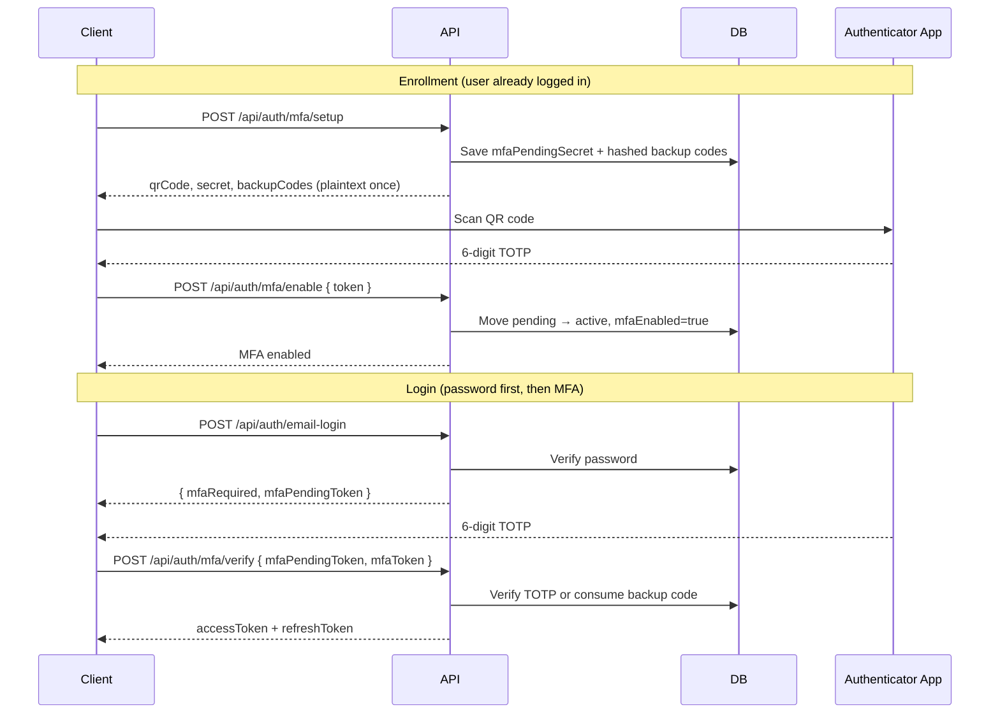
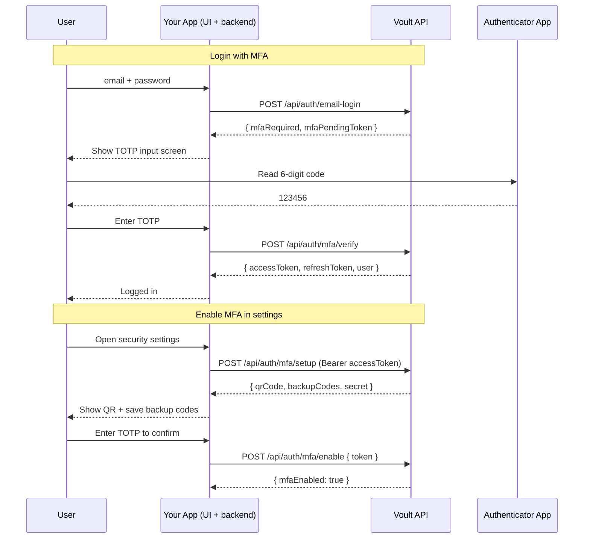

# MFA / TOTP Guide

This document explains how multi-factor authentication (MFA) works in Voult, and how to integrate it when **Voult is your authentication provider** in another codebase.

Most teams using Voult do **not** re-implement TOTP themselves. Voult owns enrollment, verification, backup codes, lockout, and audit logging. Your application calls Voult's API and handles the UI flow.

Voult uses **TOTP** (Time-based One-Time Password) compatible with Google Authenticator, Authy, 1Password, and similar apps. It also supports **one-time backup codes** for account recovery.

---

## Two integration paths

| Path | When to use it |
|------|----------------|
| **[Use Voult for MFA](#using-voult-mfa-in-your-application)** (recommended) | Your app authenticates users through Voult's API. You build login/settings UI; Voult handles all MFA logic. |
| **[Build MFA yourself](#building-mfa-yourself-alternative)** | You are implementing your own auth platform and want to port Voult's internal design. |

If Voult is already your auth layer, skip to [Using Voult MFA in your application](#using-voult-mfa-in-your-application).

---

## Overview

MFA is split into two flows:

1. **Enrollment** — an authenticated user enables MFA on their account.
2. **Login** — after a successful password check, the user must provide a TOTP code or backup code before receiving access tokens.

If you are integrating an app that uses Voult for authentication, you only interact with these flows through HTTP — see [Using Voult MFA in your application](#using-voult-mfa-in-your-application).

The diagram below shows what happens **inside Voult** when those API calls are made.

The API is **stateless**. Instead of server sessions, Voult uses:

- **Pending setup fields** on the user record during enrollment (`mfaPendingSecret`, etc.)
- A short-lived **`mfaPendingToken` JWT** during login (5-minute expiry)

---

## Architecture

Internal Voult flow (your app triggers these endpoints; Voult executes this logic):



---

## Using Voult MFA in your application

When Voult is your auth provider, MFA lives entirely on Voult's side. Your codebase is responsible for:

1. **Calling Voult's auth API** with the correct headers and request bodies
2. **Handling the two-step login UI** when `mfaRequired: true`
3. **Storing Voult tokens** (`accessToken`, `refreshToken`) in your app after successful auth
4. **Building enrollment/settings screens** that proxy to Voult's MFA endpoints

You do **not** need to install `speakeasy`, store TOTP secrets, hash backup codes, or manage lockout logic in your app.

### What Voult handles vs what your app handles

| Responsibility | Voult | Your application |
|----------------|-------|------------------|
| TOTP secret generation | ✅ | — |
| QR code rendering | ✅ | Display the `qrCode` image Voult returns |
| Backup code hashing & one-time use | ✅ | Prompt user to save codes Voult returns once |
| MFA verify / lockout / rate limits | ✅ | Show error messages from Voult responses |
| `mfaPendingToken` JWT | ✅ | Store temporarily between login steps |
| Login & settings UI | — | ✅ |
| `X-Client-Secret` | ✅ validates | ✅ keep server-side only |
| Session after login | — | ✅ store `accessToken` + `refreshToken` |

### Architecture when Voult is your auth provider



### Required headers on every Voult call

All server-to-server requests need:

```
X-Client-Id: app_your_client_id
X-Client-Secret: your_client_secret   ← never expose in browser or mobile app
Content-Type: application/json
```

Authenticated end-user requests also need:

```
Authorization: Bearer <accessToken>
```

The `X-Client-Secret` must live in your **backend** environment variables. If your frontend calls Voult directly, use a backend proxy (see below) instead of embedding the secret in client code.

### Recommended pattern: backend auth proxy

For web and mobile apps, route auth through your own backend:

```
[Browser/Mobile]  →  [Your API]  →  [Voult API]
                      ↑
              X-Client-Secret stays here
```

**Why:**

- `X-Client-Secret` never ships to the client
- You can attach your own session cookies after Voult returns tokens
- Easier to add logging, redirects, and error normalization

**Example — your backend login route:**

```javascript
// your-app/routes/auth.js
app.post('/auth/login', async (req, res) => {
  const { email, password } = req.body;

  const voultRes = await fetch(`${process.env.VOULT_BASE_URL}/api/auth/email-login`, {
    method: 'POST',
    headers: {
      'Content-Type': 'application/json',
      'X-Client-Id': process.env.VOULT_CLIENT_ID,
      'X-Client-Secret': process.env.VOULT_CLIENT_SECRET
    },
    body: JSON.stringify({ email, password })
  });

  const data = await voultRes.json();

  if (!voultRes.ok) {
    return res.status(voultRes.status).json(data);
  }

  // MFA step required — pass pending token to your frontend
  if (data.mfaRequired) {
    return res.json({
      step: 'mfa',
      mfaPendingToken: data.mfaPendingToken,
      message: data.message
    });
  }

  // Normal login — create your app session from Voult tokens
  setSession(res, data.accessToken, data.refreshToken);
  return res.json({ step: 'complete', user: data.user });
});
```

**Example — your backend MFA verify route:**

```javascript
app.post('/auth/mfa/verify', async (req, res) => {
  const { mfaPendingToken, mfaToken } = req.body;

  const voultRes = await fetch(`${process.env.VOULT_BASE_URL}/api/auth/mfa/verify`, {
    method: 'POST',
    headers: {
      'Content-Type': 'application/json',
      'X-Client-Id': process.env.VOULT_CLIENT_ID,
      'X-Client-Secret': process.env.VOULT_CLIENT_SECRET
    },
    body: JSON.stringify({ mfaPendingToken, mfaToken })
  });

  const data = await voultRes.json();

  if (!voultRes.ok) {
    return res.status(voultRes.status).json(data);
  }

  setSession(res, data.accessToken, data.refreshToken);
  return res.json({ step: 'complete', user: data.user });
});
```

`setSession` is your app's responsibility — HTTP-only cookies, secure storage on mobile, etc. Voult only issues the tokens.

### Frontend login flow (two steps)

Your login page must branch on the Voult response:

```javascript
// Step 1: password
const loginRes = await fetch('/auth/login', {
  method: 'POST',
  headers: { 'Content-Type': 'application/json' },
  body: JSON.stringify({ email, password })
});
const loginData = await loginRes.json();

if (loginData.step === 'mfa') {
  // Step 2: show MFA screen (do NOT navigate away — keep mfaPendingToken)
  showMfaScreen(loginData.mfaPendingToken);
  return;
}

// No MFA — user is logged in
redirectToDashboard();
```

```javascript
// Step 2: MFA screen submit handler
async function submitMfa(mfaPendingToken, mfaToken) {
  const res = await fetch('/auth/mfa/verify', {
    method: 'POST',
    headers: { 'Content-Type': 'application/json' },
    body: JSON.stringify({ mfaPendingToken, mfaToken })
  });

  const data = await res.json();

  if (!res.ok) {
    showError(data.error?.message || 'Invalid code');
    return;
  }

  redirectToDashboard();
}
```

`mfaToken` accepts either:

- A **6-digit TOTP** from the authenticator app
- An **8-character hex backup code** (e.g. `A1B2C3D4`)

The `mfaPendingToken` expires in **5 minutes**. If it expires, send the user back to the password login step.

### MFA enrollment in your settings page

Add a "Security" or "Two-factor authentication" section that calls Voult on behalf of the logged-in user.

**Step 1 — start setup**

```javascript
const setupRes = await fetch('/auth/mfa/setup', {
  method: 'POST',
  headers: { Authorization: `Bearer ${accessToken}` } // your proxy adds Voult client headers
});
const { qrCode, backupCodes, secret } = await setupRes.json();

// Show QR: 
// Show backupCodes in a "copy these now" modal — Voult will not return them again
// Optionally show `secret` for manual entry
```

Your proxy route:

```javascript
app.post('/auth/mfa/setup', requireUser, async (req, res) => {
  const voultRes = await fetch(`${process.env.VOULT_BASE_URL}/api/auth/mfa/setup`, {
    method: 'POST',
    headers: voultHeaders(req.voultAccessToken) // Bearer + client id/secret
  });
  return res.status(voultRes.status).json(await voultRes.json());
});
```

**Step 2 — confirm with TOTP**

```javascript
await fetch('/auth/mfa/enable', {
  method: 'POST',
  headers: { Authorization: `Bearer ${accessToken}`, 'Content-Type': 'application/json' },
  body: JSON.stringify({ token: totpFromUser })
});
```

Setup expires after **10 minutes**. If expired, call `/setup` again.

### Other MFA operations your app may expose

| User action in your app | Voult endpoint | Notes |
|-------------------------|----------------|-------|
| Check MFA status | `GET /api/auth/mfa/status` | Show badge: "2FA enabled" + backup codes remaining |
| Disable MFA | `POST /api/auth/mfa/disable` | Require password + TOTP in your form |
| Regenerate backup codes | `POST /api/auth/mfa/backup-codes/regenerate` | Requires current TOTP; show new codes once |
| Login | `POST /api/auth/email-login` → `POST /api/auth/mfa/verify` | Two-step when `mfaRequired` |

Disabling MFA or regenerating backup codes invalidates existing Voult sessions (`tokenVersion` bump). Log the user out everywhere in your app after these actions.

### Error handling in your app

| Voult response | HTTP | What to show the user |
|----------------|------|----------------------|
| `mfaRequired: true` | 200 | MFA input screen |
| `INVALID_MFA_TOKEN` | 401 | "Invalid code. Try again." |
| `INVALID_MFA_SESSION` | 401 | "Session expired. Log in again." |
| `ACCOUNT_LOCKED` | 423 | "Too many attempts. Try again in 15 minutes." |
| `MFA_SETUP_EXPIRED` | 400 | "Setup timed out. Start again." |
| `MFA_ALREADY_ENABLED` | 400 | "MFA is already on." |
| Rate limit on `/mfa/verify` | 429 | "Too many attempts. Wait and retry." |

Always surface Voult's `error.message` rather than raw status codes.

### Environment variables in your codebase

```bash
# your-app/.env
VOULT_BASE_URL=https://api.voult.dev
VOULT_CLIENT_ID=app_abc123
VOULT_CLIENT_SECRET=your_secret_here   # server-side only
```

Never commit `VOULT_CLIENT_SECRET` to git or ship it in frontend bundles.

### SPA, Next.js, and mobile apps

The integration pattern is the same across platforms:

| Platform | Login flow | Where `X-Client-Secret` lives |
|----------|------------|-------------------------------|
| React / Vue SPA | Frontend → your `/auth/login` API → Voult | Backend env only |
| Next.js | Server Actions or `/api/auth/*` route handlers | `process.env` on server |
| React Native / Flutter | App → your backend → Voult | Backend env only |
| Native iOS / Android | Same as mobile — never embed secret in the app binary |

**SPA state management tip:** after password login returns `step: 'mfa'`, store `mfaPendingToken` in React state (or a short-lived memory store). Do not put it in `localStorage` — it is a temporary step-up credential, not a session token.

**Mobile tip:** use secure storage (Keychain / EncryptedSharedPreferences) for `accessToken` and `refreshToken` only after MFA verify completes.

### Checklist: adding MFA to an app that uses Voult for auth

- [ ] Add `VOULT_CLIENT_ID` and `VOULT_CLIENT_SECRET` to backend env
- [ ] Proxy login through your backend; branch on `mfaRequired`
- [ ] Build MFA verification screen; pass `mfaPendingToken` + `mfaToken` to `/api/auth/mfa/verify`
- [ ] Store `accessToken` + `refreshToken` only after MFA verify succeeds (or after login when MFA is off)
- [ ] Add settings UI: setup → show QR + backup codes → enable
- [ ] Handle `INVALID_MFA_SESSION` by restarting login
- [ ] Handle `ACCOUNT_LOCKED` (423) with a clear cooldown message
- [ ] Log user out locally after disable or backup code regeneration
- [ ] Do **not** store TOTP secrets or backup codes in your database

### What you can skip entirely

If Voult is your auth provider, you do **not** need in your codebase:

- `speakeasy` / `qrcode` dependencies
- User model fields like `mfaSecret`, `mfaBackupCodes`
- TOTP verification logic
- Backup code hashing
- `mfaPendingToken` signing (Voult signs it; you pass it through)
- MFA rate limiting or lockout logic

Reference the [Voult internals](#how-mfa-works-in-voult) section below only if you need to understand what happens server-side.

---

## How MFA works in Voult

This section documents Voult's internal implementation. Read it for debugging or security review — not required if you are only integrating via API.

### Key files in this codebase

| File | Responsibility |
|------|----------------|
| `services/mfaService.js` | TOTP generation/verification, backup codes, lockout helpers |
| `controllers/api/mfa.js` | Enrollment, login verification, disable, backup code regeneration |
| `routes/api/mfa.js` | Route definitions under `/api/auth/mfa` |
| `validators/api/mfa.js` | Request validation (Joi) |
| `models/endUser.js` | MFA fields on the user schema |
| `utils/jwt.js` | `signMfaPendingToken` / `verifyMfaPendingToken` |
| `controllers/api/auth.js` | Password login returns `mfaPendingToken` when MFA is enabled |
| `services/authLoginService.js` | Shared logic to issue tokens after successful auth |
| `tests/services/mfaService.test.js` | Unit tests |
| `tests/integration/mfa.integration.test.js` | Controller integration tests |

### Dependencies (Voult only)

```bash
npm install speakeasy qrcode
```

- **speakeasy** — RFC 6238 TOTP secret generation and verification
- **qrcode** — generates a scannable QR image from the `otpauth://` URL

### Database fields

Add these fields to your user model (sensitive fields use `select: false` so they are not returned by default):

```javascript
mfaEnabled: { type: Boolean, default: false },
mfaSecret: { type: String, select: false },
mfaBackupCodes: { type: [String], select: false, default: [] }, // SHA-256 hashes
mfaEnabledAt: Date,

// Pending enrollment (expires after 10 minutes)
mfaPendingSecret: { type: String, select: false },
mfaPendingBackupCodes: { type: [String], select: false, default: [] },
mfaPendingExpires: Date,

// Brute-force protection
failedMfaAttempts: { type: Number, default: 0 },
mfaLockUntil: { type: Date, default: null }
```

**Never store:**

- Plaintext TOTP secrets in API responses after enrollment completes
- Plaintext backup codes in the database (only SHA-256 hashes)

---

## Voult API reference

These are the endpoints your application calls (directly or via a backend proxy). See [Using Voult MFA in your application](#using-voult-mfa-in-your-application) for integration patterns.

### Enrollment flow

### Step 1 — Start setup

**`POST /api/auth/mfa/setup`**

Requires: authenticated end-user (`Authorization: Bearer <accessToken>`), app client headers (`X-Client-Id`, `X-Client-Secret`).

```json
// Response
{
  "message": "Scan the QR code with your authenticator app, then confirm with a 6-digit code",
  "qrCode": "data:image/png;base64,...",
  "secret": "JBSWY3DPEHPK3PXP",
  "backupCodes": ["A1B2C3D4", "E5F6A7B8", "..."]
}
```

What happens server-side:

1. Generate a TOTP secret via `speakeasy.generateSecret()`
2. Render QR code from `secret.otpauth_url`
3. Generate 10 backup codes; hash them before saving
4. Store secret + hashed codes in **pending** fields with a 10-minute expiry
5. Return QR code, manual-entry secret, and **plaintext backup codes once**

The client should prompt the user to save backup codes immediately. They cannot be retrieved later except by regenerating new ones.

### Step 2 — Confirm and enable

**`POST /api/auth/mfa/enable`**

```json
// Request
{ "token": "123456" }

// Response
{ "message": "MFA enabled successfully", "mfaEnabled": true }
```

What happens server-side:

1. Verify the 6-digit TOTP against `mfaPendingSecret`
2. Move pending secret/codes to active fields
3. Set `mfaEnabled = true`, clear pending fields
4. Increment `tokenVersion` (invalidates existing sessions)

If setup expires (10 minutes), the user must call `/setup` again.

---

## Login flow

### Step 1 — Password authentication

**`POST /api/auth/email-login`** (or `/username-login`)

If MFA is **not** enabled, the response is a normal login:

```json
{
  "message": "Login successful",
  "accessToken": "...",
  "refreshToken": "...",
  "user": { "id": "...", "email": "...", "mfaEnabled": false }
}
```

If MFA **is** enabled, tokens are withheld:

```json
{
  "mfaRequired": true,
  "mfaPendingToken": "eyJhbGciOiJIUzI1NiIs...",
  "message": "MFA verification required"
}
```

The `mfaPendingToken` is a JWT that:

- Expires in **5 minutes**
- Contains `sub` (user ID), `appId`, `tokenVersion`, and `purpose: "mfa_pending"`
- Is bound to the app via JWT `audience`

### Step 2 — MFA verification

**`POST /api/auth/mfa/verify`**

Requires app client headers only (no access token yet).

```json
// Request
{
  "mfaPendingToken": "eyJhbGciOiJIUzI1NiIs...",
  "mfaToken": "123456"
}

// Response — same as a normal successful login
{
  "message": "Login successful",
  "accessToken": "...",
  "refreshToken": "...",
  "user": { "id": "...", "email": "...", "mfaEnabled": true }
}
```

Verification order:

1. Validate `mfaPendingToken` signature, expiry, and `tokenVersion`
2. Check MFA lockout (`mfaLockUntil`)
3. Try TOTP verification against `mfaSecret`
4. If TOTP fails, try backup code (one-time use — removed after success)
5. On failure: increment `failedMfaAttempts`, lock after 5 failures (15 minutes)
6. On success: issue access + refresh tokens via `completeEndUserLogin()`

`mfaToken` accepts either:

- A **6-digit TOTP** from the authenticator app
- An **8-character hex backup code** (e.g. `A1B2C3D4`)

---

## Other endpoints

| Endpoint | Auth required | Purpose |
|----------|---------------|---------|
| `GET /api/auth/mfa/status` | Yes | Returns `mfaEnabled`, `mfaEnabledAt`, `backupCodesRemaining` |
| `POST /api/auth/mfa/disable` | Yes | Disables MFA; requires password + TOTP/backup code |
| `POST /api/auth/mfa/backup-codes/regenerate` | Yes | Issues new backup codes; requires current TOTP |

Disabling MFA or regenerating backup codes increments `tokenVersion`, forcing re-login on all devices.

---

## Security properties

| Property | Implementation |
|----------|----------------|
| Secret storage | `mfaSecret` stored with `select: false`; never returned in API responses |
| Backup codes | SHA-256 hashed; verified with constant-time comparison |
| Setup expiry | Pending enrollment expires after 10 minutes |
| Login step-up | `mfaPendingToken` expires after 5 minutes |
| Session invalidation | `tokenVersion` bumped on enable, disable, and backup code regeneration |
| Brute-force protection | 5 failed MFA attempts → 15-minute lockout |
| Rate limiting | `/mfa/verify` limited to 10 attempts per 15 minutes |
| Audit logging | `MFA_ENABLED`, `MFA_DISABLED`, `MFA_VERIFY_FAILURE` events logged |

---

## Building MFA yourself (alternative)

Only follow this section if you are **building your own auth platform**, not using Voult as your provider. If Voult handles your authentication, use the [integration guide above](#using-voult-mfa-in-your-application) instead.

Use this checklist to port the Voult design into a self-hosted auth system.

### 1. Install dependencies

```bash
npm install speakeasy qrcode
```

### 2. Create an MFA service

Port `services/mfaService.js`. The core methods you need:

```javascript
generateSecret(email)       // speakeasy.generateSecret()
generateQRCode(secret)      // QRCode.toDataURL(secret.otpauth_url)
verifyToken(secret, token)  // speakeasy.totp.verify({ window: 2 })
generateBackupCodes(10)     // crypto.randomBytes(4).toString('hex')
hashBackupCode(code)        // SHA-256
consumeBackupCode(code, hashedCodes) // find, constant-time compare, remove
```

Use `window: 2` in TOTP verification to allow ±30 seconds of clock drift.

### 3. Add user model fields

Add the fields listed in [Database fields](#database-fields). Use `select: false` (or your ORM equivalent) for secrets and backup code hashes.

### 4. Build enrollment endpoints

```
POST /mfa/setup   → authenticated user → return QR + backup codes
POST /mfa/enable  → authenticated user → verify TOTP → activate MFA
```

**Important:** Do not use server sessions if your API is stateless (mobile apps, SPAs). Store pending setup data on the user record with an expiry timestamp, as Voult does.

### 5. Build the two-step login flow

Modify your existing login handler:

```javascript
// After password is verified:
if (user.mfaEnabled) {
  const mfaPendingToken = signMfaPendingToken(user, app);
  return res.json({ mfaRequired: true, mfaPendingToken });
}

// Otherwise issue tokens normally
return issueTokens(user);
```

Create a separate MFA verification endpoint:

```javascript
// POST /mfa/verify
const decoded = verifyMfaPendingToken(mfaPendingToken, app);
const user = await User.findById(decoded.sub).select('+mfaSecret +mfaBackupCodes');

if (!verifyToken(user.mfaSecret, mfaToken)) {
  const backup = consumeBackupCode(mfaToken, user.mfaBackupCodes);
  if (!backup.valid) throw invalidMfaError();
  user.mfaBackupCodes = backup.remainingCodes;
  await user.save();
}

return issueTokens(user);
```

### 6. Add a pending MFA JWT

```javascript
function signMfaPendingToken(user, app) {
  return jwt.sign(
    { sub: user.id, appId: app.id, tokenVersion: user.tokenVersion, purpose: 'mfa_pending' },
    SECRET,
    { expiresIn: '5m', audience: app.id }
  );
}

function verifyMfaPendingToken(token, app) {
  const decoded = jwt.verify(token, SECRET, { audience: app.id });
  if (decoded.purpose !== 'mfa_pending') throw new Error('Invalid token');
  return decoded;
}
```

Always validate `tokenVersion` in the pending token matches the user's current value. This prevents completing MFA with a token issued before a password reset or forced logout.

### 7. Add disable and backup code regeneration

Require **both** the account password and a valid TOTP (or backup code) to disable MFA. Never allow disable with password alone.

Backup code regeneration should:

- Require a valid TOTP
- Replace all existing hashed codes
- Increment `tokenVersion` to invalidate sessions

### 8. Add rate limiting and audit logging

- Rate-limit the MFA verify endpoint (Voult: 10 requests / 15 min)
- Log enrollment, verification failures, disable events
- Lock the account after repeated MFA failures

### 9. Write tests

At minimum, test:

- TOTP generation and verification
- Backup code hash/consume semantics
- Pending token expiry
- Lockout after N failed attempts
- `tokenVersion` mismatch rejection

See `tests/services/mfaService.test.js` and `tests/integration/mfa.integration.test.js` in this repo for examples.

---

## Direct Voult API calls (server-side only)

If your backend calls Voult directly (no proxy abstraction), the request shapes are:

```javascript
// Login
const loginRes = await fetch(`${VOULT_BASE_URL}/api/auth/email-login`, {
  method: 'POST',
  headers: {
    'Content-Type': 'application/json',
    'X-Client-Id': process.env.VOULT_CLIENT_ID,
    'X-Client-Secret': process.env.VOULT_CLIENT_SECRET
  },
  body: JSON.stringify({ email, password })
});

// MFA verify (when loginRes returns mfaRequired: true)
const mfaRes = await fetch(`${VOULT_BASE_URL}/api/auth/mfa/verify`, {
  method: 'POST',
  headers: {
    'Content-Type': 'application/json',
    'X-Client-Id': process.env.VOULT_CLIENT_ID,
    'X-Client-Secret': process.env.VOULT_CLIENT_SECRET
  },
  body: JSON.stringify({ mfaPendingToken, mfaToken })
});
```

Prefer the [backend proxy pattern](#recommended-pattern-backend-auth-proxy) so your frontend never handles Voult client credentials.

---

## Differences from the security hardening guide draft

The original `SECURITY_HARDENING_GUIDE.md` example used **Express sessions** (`req.session.mfaSetup`) for pending enrollment. The implemented Voult version uses **database pending fields** instead, because the API auth layer is JWT-based and clients may not have cookies.

When porting to a **session-based web app**, you can store pending setup in the session instead of the database. The TOTP verification and backup code logic remains the same.

---

## Common pitfalls

### When using Voult as your auth provider

1. **Exposing `X-Client-Secret` in frontend code** — always proxy auth through your backend.
2. **Storing tokens before MFA completes** — only persist `accessToken`/`refreshToken` after `/mfa/verify` succeeds.
3. **Losing `mfaPendingToken`** — keep it in component state between login steps; it expires in 5 minutes.
4. **Not handling backup codes at enrollment** — Voult returns them once during `/setup`; your UI must prompt the user to save them.
5. **Ignoring session invalidation** — after disable or backup code regeneration, log users out locally.

### When building MFA yourself
1. **Returning the TOTP secret after enrollment** — only expose it during setup. After `/enable`, never send `mfaSecret` to the client.
2. **Storing backup codes in plaintext** — always hash before persistence.
3. **Skipping `tokenVersion` checks** — without this, a stolen `mfaPendingToken` could work after a password reset.
4. **Allowing MFA disable with password only** — always require a second factor to turn MFA off.
5. **No clock drift tolerance** — use `window: 2` in speakeasy verify or legitimate users with slightly wrong device clocks will fail.
6. **Reusing backup codes** — always remove a backup code hash after successful use.

---

## Related documentation

- [WEBAUTHN_GUIDE.md](./WEBAUTHN_GUIDE.md) — Passwordless passkey authentication
- [SECURITY_HARDENING_GUIDE.md](./SECURITY_HARDENING_GUIDE.md) — Issue #10 (original MFA spec)
- [PRODUCTION_READINESS_CERTIFICATION.md](./PRODUCTION_READINESS_CERTIFICATION.md) — Phase 3 MFA checklist
