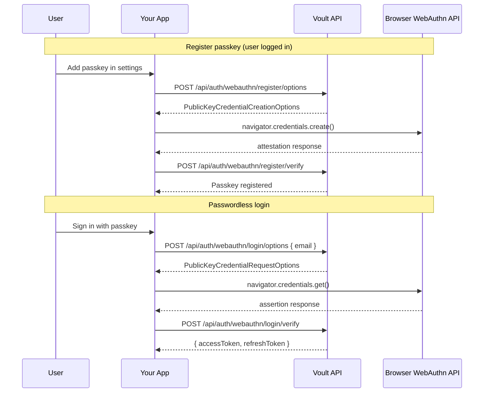

# WebAuthn / Passkey Guide

This document explains Voult's passwordless WebAuthn (passkey) implementation and how to integrate it when **Voult is your authentication provider**.

It fulfills the Phase 4 checklist in [PRODUCTION_READINESS_CERTIFICATION.md](./PRODUCTION_READINESS_CERTIFICATION.md) and the "WebAuthn passwordless authentication" deliverable in [SECURITY_HARDENING_GUIDE.md](./SECURITY_HARDENING_GUIDE.md).

---

## Overview

WebAuthn lets end users sign in with **passkeys** (biometrics, device PIN, or security keys) instead of passwords. Voult handles:

- Challenge generation and verification (`@simplewebauthn/server`)
- Credential storage (public keys only — never private keys)
- Device management (list, rename, delete passkeys)
- Audit logging for registration, login failures, and credential removal
- Cross-browser algorithm support (ES256, RS256, EdDSA)

Your application provides the UI and proxies API calls to Voult.

---

## Architecture



---

## API endpoints

All routes are under `/api/auth/webauthn`. Require `X-Client-Id` + `X-Client-Secret` on every call.

| Method | Path | Auth | Purpose |
|--------|------|------|---------|
| `GET` | `/compatibility` | Client | Browser support matrix + RP config |
| `POST` | `/register/options` | Bearer + active user | Start passkey registration |
| `POST` | `/register/verify` | Bearer + active user | Complete registration |
| `POST` | `/login/options` | Client | Start passwordless login |
| `POST` | `/login/verify` | Client | Complete login → tokens |
| `GET` | `/credentials` | Bearer + active user | List registered passkeys |
| `PATCH` | `/credentials/:id` | Bearer + active user | Rename a passkey |
| `DELETE` | `/credentials/:id` | Bearer + active user | Remove a passkey |

---

## Environment configuration

```bash
BASE_URL=https://app.voult.dev          # Used to derive rpID and origin

# Optional overrides (see SECURITY_HARDENING_GUIDE production config)
WEBAUTHN_RP_ID=voult.dev                # Must match site hostname
WEBAUTHN_ORIGIN=https://app.voult.dev   # Exact origin for verification
WEBAUTHN_RP_NAME=My App                 # Shown in authenticator UI
```

**Production requirements** (from certification docs):

- HTTPS required (localhost exempt for development)
- `WEBAUTHN_RP_ID` must match the domain users authenticate on
- `WEBAUTHN_ORIGIN` must exactly match the page origin calling WebAuthn

---

## Integrating from your application

### 1. Install client library

```bash
npm install @simplewebauthn/browser
```

### 2. Register a passkey (settings page)

```javascript
import { startRegistration } from '@simplewebauthn/browser';

// User is logged in — your backend proxies to Voult
const optionsRes = await fetch('/auth/webauthn/register/options', {
  method: 'POST',
  headers: { Authorization: `Bearer ${accessToken}` },
  body: JSON.stringify({ deviceName: 'MacBook Pro' })
});
const { options } = await optionsRes.json();

const credential = await startRegistration({ optionsJSON: options });

await fetch('/auth/webauthn/register/verify', {
  method: 'POST',
  headers: { Authorization: `Bearer ${accessToken}`, 'Content-Type': 'application/json' },
  body: JSON.stringify({ credential, deviceName: 'MacBook Pro' })
});
```

### 3. Passwordless login

```javascript
import { startAuthentication } from '@simplewebauthn/browser';

const optionsRes = await fetch('/auth/webauthn/login/options', {
  method: 'POST',
  headers: { 'Content-Type': 'application/json' },
  body: JSON.stringify({ email: 'user@example.com' })
});
const { options } = await optionsRes.json();

const credential = await startAuthentication({ optionsJSON: options });

const loginRes = await fetch('/auth/webauthn/login/verify', {
  method: 'POST',
  headers: { 'Content-Type': 'application/json' },
  body: JSON.stringify({ credential })
});

const { accessToken, refreshToken } = await loginRes.json();
```

### 4. Device management

```javascript
// List devices
const list = await fetch('/auth/webauthn/credentials', {
  headers: { Authorization: `Bearer ${accessToken}` }
});

// Rename
await fetch(`/auth/webauthn/credentials/${id}`, {
  method: 'PATCH',
  headers: { Authorization: `Bearer ${accessToken}`, 'Content-Type': 'application/json' },
  body: JSON.stringify({ deviceName: 'Work Laptop' })
});

// Remove
await fetch(`/auth/webauthn/credentials/${id}`, {
  method: 'DELETE',
  headers: { Authorization: `Bearer ${accessToken}` }
});
```

Proxy these through your backend the same way as MFA — keep `X-Client-Secret` server-side. See [MFA_TOTP_GUIDE.md](./MFA_TOTP_GUIDE.md#recommended-pattern-backend-auth-proxy).

---

## MFA interaction

Passkey login is **phishing-resistant** and satisfies multi-factor requirements on its own. When a user signs in via WebAuthn:

- Password is not required
- TOTP/MFA step is **skipped** (passkey replaces password + second factor)
- Audit log records `method: 'webauthn'`

Users can still use password + MFA login if they prefer. Passkeys are additive — register them from the security settings page while logged in.

---

## Cross-browser support

`GET /api/auth/webauthn/compatibility` returns:

| Browser | Min version | Passkeys |
|---------|-------------|----------|
| Chrome | 67+ | ✅ Desktop, Android |
| Firefox | 60+ | ✅ Desktop |
| Safari | 13+ | ✅ macOS, iOS |
| Edge | 18+ | ✅ Desktop |

**Supported algorithms:** EdDSA (`-8`), ES256 (`-7`), RS256 (`-257`)

Use `@simplewebauthn/browser` on the client — it normalizes API differences across browsers.

---

## Security properties

| Property | Implementation |
|----------|----------------|
| Private keys | Never leave the authenticator device |
| Public key storage | `WebAuthnCredential` model, `select: false` on sensitive fields |
| Challenge expiry | 5 minutes, TTL index on `WebAuthnChallenge` |
| Replay protection | Signature counter incremented on each login |
| Origin validation | `expectedOrigin` + `expectedRPID` on every verify |
| Rate limiting | IP limiter on login; per-user limiter on registration |
| Audit logging | `WEBAUTHN_REGISTERED`, `WEBAUTHN_LOGIN_FAILURE`, `WEBAUTHN_CREDENTIAL_REMOVED` |
| Email verification | Required before passkey registration (when email present) |

---

## Key files in this codebase

| File | Responsibility |
|------|----------------|
| `services/webAuthnService.js` | Challenge/options generation, verification, device CRUD |
| `controllers/api/webauthn.js` | HTTP handlers, audit logging, login completion |
| `routes/api/webauthn.js` | Route definitions under `/api/auth/webauthn` |
| `models/webAuthnCredential.js` | Stored passkey public keys per user per app |
| `models/webAuthnChallenge.js` | Short-lived challenges with MongoDB TTL |
| `validators/api/webauthn.js` | Joi request validation |
| `tests/services/webAuthnService.test.js` | Config and compatibility unit tests |
| `tests/integration/webauthn.integration.test.js` | Controller flow tests |

### Dependency

```bash
npm install @simplewebauthn/server
```

Client integrators should also install `@simplewebauthn/browser`.

---

## Common pitfalls

1. **rpID mismatch** — `WEBAUTHN_RP_ID` must match the browser's hostname exactly.
2. **HTTP in production** — WebAuthn requires secure contexts except localhost.
3. **Calling Voult from the browser with client secret** — always proxy through your backend.
4. **Skipping backup auth** — keep password login available; passkeys are optional.
5. **Not saving device names** — prompt users to label passkeys for easier device management.

---

## Related documentation

- [MFA_TOTP_GUIDE.md](./MFA_TOTP_GUIDE.md) — TOTP integration when Voult is your auth provider
- [PRODUCTION_READINESS_CERTIFICATION.md](./PRODUCTION_READINESS_CERTIFICATION.md) — Phase 4 WebAuthn checklist
- [SECURITY_HARDENING_GUIDE.md](./SECURITY_HARDENING_GUIDE.md) — Phase 4 advanced features roadmap
- [OVERALL_SECURITY.MD](./OVERALL_SECURITY.MD) — Platform security assessment
